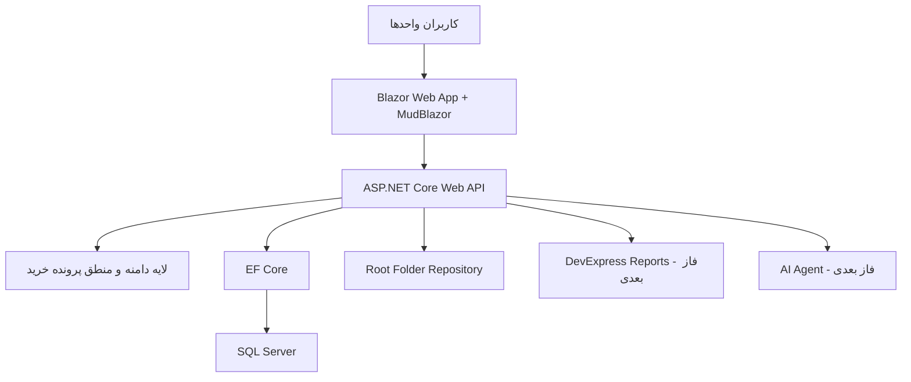
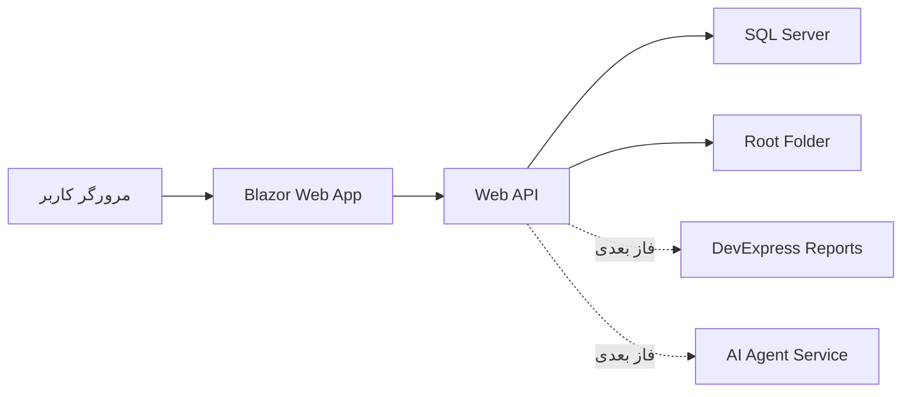

# نمای کلی معماری

## رویکرد معماری

معماری PetroProcure باید ماژولار، قابل توسعه و مناسب محیط سازمانی پالایشگاه باشد. انتخاب فناوری‌ها به گونه‌ای است که بتوان سرویس‌های اصلی، رابط کاربری، پایگاه داده، ذخیره‌سازی فایل، گزارش‌گیری و قابلیت‌های آینده هوش مصنوعی را به صورت مرحله‌ای توسعه داد.

## پشته فناوری

- ASP.NET Aspire برای ارکستراسیون پروژه‌ها، تنظیمات محیطی و اجرای محلی سرویس‌ها
- ASP.NET Core Web API برای ارائه سرویس‌های تجاری و داده‌ای
- Blazor Web App به همراه MudBlazor برای رابط کاربری پنل‌ها
- SQL Server برای ذخیره‌سازی داده‌های ساخت‌یافته
- EF Core برای دسترسی به داده‌ها و مدیریت مدل دامنه
- Root Folder Repository برای نگهداری فایل‌ها و پیوست‌های پرونده
- DevExpress Reports در فازهای بعدی برای گزارش‌ها و فرم‌های رسمی
- AI Agent در فازهای بعدی برای بررسی اسناد، خلاصه‌سازی و RAG

## ساختار منطقی پیشنهادی

## مرزبندی لایه‌ها

### رابط کاربری

رابط کاربری باید بر اساس پنل‌های سازمانی ساخته شود. هر پنل فقط عملیات مرتبط با همان نقش سازمانی را نمایش دهد. MudBlazor برای جدول‌ها، فرم‌ها، دیالوگ‌ها، تب‌ها، فیلترها و نمایش وضعیت‌ها استفاده می‌شود.

### Web API

Web API نقطه اصلی دسترسی به منطق سامانه است. همه عملیات مهم مانند ایجاد پرونده، ثبت اقلام، پیوست سند، تغییر وضعیت، ارسال به واحد بعدی و تولید گزارش باید از API عبور کند.

### لایه دامنه

لایه دامنه باید مفاهیم اصلی مانند Purchase File، Indent، MESC Item، Attachment، Workflow State و Department Action را نگهداری کند. قواعد مهم مانند ساختار Indent Number و گروه‌بندی MESC نباید فقط در UI پیاده‌سازی شوند.

### پایگاه داده

SQL Server محل نگهداری اطلاعات ساخت‌یافته است. فایل‌های فیزیکی در پایگاه داده ذخیره نمی‌شوند، بلکه مسیر، شناسه، نوع، هش یا متادیتای فایل در پایگاه داده ثبت می‌شود.

### ذخیره‌سازی فایل

فایل‌ها در یک Root Folder Repository نگهداری می‌شوند. ساختار پوشه‌ها باید بر اساس شناسه پرونده خرید، نوع سند و نسخه سند قابل سازماندهی باشد.

## اصول طراحی

- پرونده خرید مرکز همه ارتباطات دامنه است.
- API باید مستقل از UI طراحی شود تا در آینده امکان اتصال سیستم‌های دیگر وجود داشته باشد.
- قواعد MESC و Indent باید در سمت سرور اعتبارسنجی شوند.
- مسیر فایل‌ها نباید به صورت پراکنده در بخش‌های مختلف برنامه تولید شود.
- گزارش‌گیری رسمی باید از ابتدا در طراحی داده‌ها در نظر گرفته شود، حتی اگر در فاز اول پیاده‌سازی نشود.
- AI Agent نباید به صورت مستقیم مالک داده‌ها باشد؛ باید از سرویس‌های رسمی سامانه و مخزن اسناد استفاده کند.

## نمای استقرار اولیه

