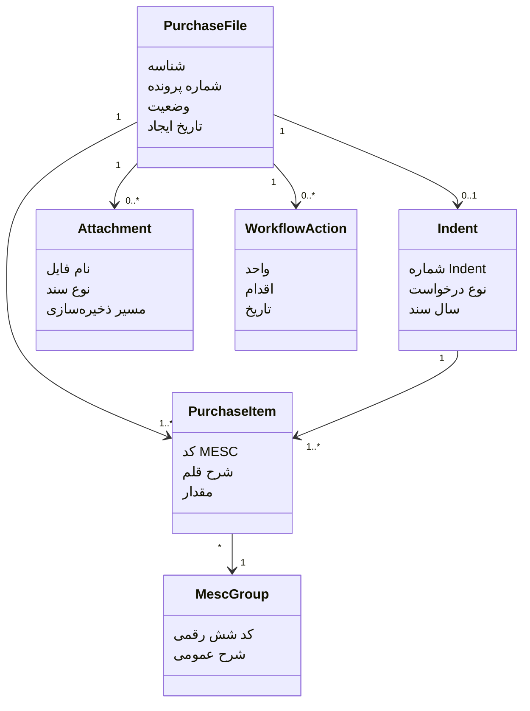

# ماژول‌های دامنه

## هسته دامنه

هسته دامنه PetroProcure حول پرونده خرید شکل می‌گیرد. سایر ماژول‌ها باید یا مستقیم به پرونده خرید وابسته باشند یا از طریق یک سند، قلم کالا، وضعیت گردش کار یا گزارش به آن متصل شوند.

## ماژول‌های اصلی

### 1. مدیریت پرونده خرید

مسئول نگهداری اطلاعات اصلی پرونده است:

- شماره پرونده
- عنوان یا شرح خرید
- وضعیت فعلی
- واحد متقاضی
- تاریخ ایجاد
- نوع خرید
- ارتباط با Indent
- لیست اقلام
- لیست اسناد و پیوست‌ها

### 2. مدیریت Indent یا درخواست خرید

هر Indent دارای یک شماره با قالب مشخص است و می‌تواند چندین قلم کالا داشته باشد. Indent می‌تواند مبنای تشکیل پرونده خرید باشد.

مسئولیت‌ها:

- اعتبارسنجی شماره Indent
- نگهداری نوع درخواست
- نگهداری اقلام زیر یک شماره Indent
- ارتباط دادن Indent با پرونده خرید

### 3. مدیریت اقلام و MESC

کد MESC شناسه اصلی اقلام است. شش رقم اول کد، گروه عمومی و شرح عمومی کالا را مشخص می‌کند. کدهای جزئی‌تر فرزند همان گروه عمومی محسوب می‌شوند.

مسئولیت‌ها:

- ثبت کد MESC قلم کالا
- استخراج گروه عمومی شش‌رقمی
- نمایش شرح عمومی کنار کد کالا
- گروه‌بندی اقلام هم‌گروه در فرم‌ها و گزارش‌ها

### 4. مدیریت اسناد و پیوست‌ها

هر پرونده خرید باید بتواند چندین سند و پیوست داشته باشد. فایل فیزیکی در Root Folder نگهداری می‌شود و متادیتای آن در پایگاه داده ثبت می‌شود.

نمونه انواع سند:

- درخواست خرید
- استعلام
- پیشنهاد تامین‌کننده
- صورتجلسه
- مجوزها
- مکاتبات داخلی
- اسناد کمیسیون مناقصه

### 5. گردش کار پرونده

گردش کار مشخص می‌کند پرونده در هر لحظه در اختیار کدام واحد است و چه اقدامی باید انجام شود.

واحدهای اصلی:

- واحد خرید
- سفارشات و کنترل موجودی
- انبار
- متقاضی
- کمیسیون مناقصه

### 6. گزارش‌گیری

گزارش‌گیری در فازهای بعدی با DevExpress Reports انجام می‌شود، اما داده‌ها و قواعد دامنه باید از ابتدا برای گزارش آماده باشند.

گزارش‌ها باید بتوانند:

- پرونده خرید را چاپ کنند
- اقلام را بر اساس گروه عمومی MESC مرتب کنند
- چند قلم زیر یک شرح عمومی MESC را در یک بخش نمایش دهند
- Indent و اقلام آن را نمایش دهند

### 7. عامل هوش مصنوعی

AI Agent در فازهای بعدی به عنوان یک ماژول کمکی اضافه می‌شود و باید از داده‌ها و اسناد موجود در پرونده خرید استفاده کند.

قابلیت‌های آینده:

- خلاصه‌سازی پرونده خرید
- بررسی مدارک پرونده
- کنترل رعایت قواعد خرید
- آماده‌سازی برای RAG بر اساس اسناد ذخیره‌شده

## ارتباط ماژول‌ها

