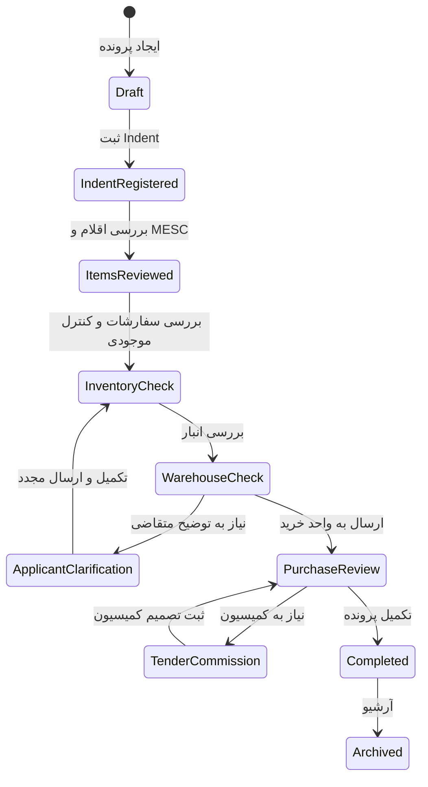

# گردش کار پرونده خرید

## تعریف پرونده خرید

پرونده خرید ظرف اصلی اطلاعات یک فرآیند خرید است. هر تصمیم، سند، قلم کالا، نظر واحدها و خروجی رسمی باید در نهایت به یک پرونده خرید قابل ردیابی متصل باشد.

## چرخه عمر پیشنهادی

وضعیت‌های دقیق در زمان پیاده‌سازی نهایی می‌شوند، اما چرخه عمر پایه می‌تواند شامل مراحل زیر باشد:

1. ایجاد پیش‌نویس پرونده
2. ثبت یا اتصال Indent
3. ثبت اقلام و کدهای MESC
4. بررسی توسط سفارشات و کنترل موجودی
5. بررسی موجودی یا وضعیت انبار
6. تکمیل اطلاعات توسط متقاضی در صورت نیاز
7. بررسی و اقدام توسط واحد خرید
8. ارجاع به کمیسیون مناقصه در صورت نیاز
9. تکمیل تصمیم نهایی خرید
10. بستن یا آرشیو پرونده

## نمای کلی گردش کار

## قواعد عملیاتی

- هر تغییر وضعیت باید در تاریخچه پرونده ثبت شود.
- هر اقدام باید شامل واحد اقدام‌کننده، کاربر، تاریخ، توضیح و وضعیت جدید باشد.
- حذف سند یا قلم از پرونده پس از ورود به مراحل رسمی باید محدود و قابل ردگیری باشد.
- اگر پرونده به دلیل نقص اطلاعات بازگردانده شود، دلیل بازگشت باید اجباری باشد.
- هر پرونده باید در هر لحظه وضعیت فعلی و واحد مسئول فعلی داشته باشد.

## نقش Indent در پرونده خرید

Indent می‌تواند نقطه شروع یا سند مرجع پرونده باشد. یک Indent شامل چند قلم کالاست و همه این اقلام زیر یک شماره Indent قرار می‌گیرند. پرونده خرید باید بتواند اقلام Indent را نگهداری و در صورت نیاز برای گزارش‌ها و فرم‌ها گروه‌بندی کند.

## نقش MESC در گردش کار

در تمام مراحل که اقلام نمایش داده می‌شوند، کد MESC باید همراه با شرح عمومی شش‌رقمی آن نشان داده شود. این موضوع برای بررسی تخصصی، کنترل موجودی، گزارش‌گیری و جلوگیری از ابهام در شناسایی کالا ضروری است.

## نقاط کنترل پیشنهادی

### کنترل هنگام ثبت اقلام

- کد MESC خالی نباشد.
- حداقل شش رقم اول کد معتبر باشد.
- شرح عمومی گروه MESC قابل بازیابی باشد.
- اقلام با گروه MESC مشابه در UI و گزارش‌ها قابل گروه‌بندی باشند.

### کنترل هنگام ارسال به واحد بعدی

- پرونده دارای Indent معتبر باشد، اگر نوع فرآیند به آن نیاز دارد.
- مدارک اجباری بارگذاری شده باشند.
- اقلام دارای مقدار و واحد سنجش باشند.
- وضعیت فعلی اجازه ارسال به مرحله بعد را داشته باشد.

### کنترل هنگام بستن پرونده

- همه اقدامات لازم ثبت شده باشند.
- اسناد نهایی پرونده موجود باشند.
- تصمیم نهایی خرید مشخص باشد.
- پرونده برای گزارش‌گیری رسمی آماده باشد.

