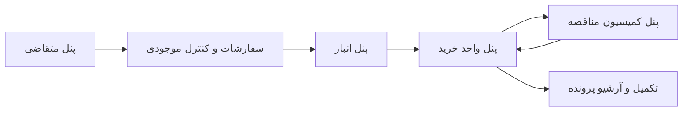

# واحدها و پنل‌های سامانه

## هدف پنل‌ها

هر پنل باید نمای کاری همان واحد را نمایش دهد. طراحی پنل‌ها باید به گونه‌ای باشد که کاربر فقط پرونده‌ها، وظایف، فیلترها و عملیات مرتبط با نقش خود را ببیند.

## پنل‌های اصلی

### 1. پنل واحد خرید

مسئولیت‌ها:

- مشاهده پرونده‌های ارجاع‌شده به خرید
- بررسی اطلاعات خرید
- مدیریت مراحل خرید مستقیم یا مناقصه
- ثبت تصمیم‌ها و توضیحات خرید
- آماده‌سازی داده‌های لازم برای گزارش‌های رسمی
- ارسال پرونده به کمیسیون مناقصه در صورت نیاز

عملیات پیشنهادی:

- مشاهده لیست پرونده‌های در انتظار اقدام
- ثبت اقدام خرید
- مشاهده اقلام گروه‌بندی‌شده بر اساس MESC
- مشاهده و بارگذاری اسناد خرید
- تغییر وضعیت پرونده در محدوده مجاز

### 2. پنل سفارشات و کنترل موجودی

مسئولیت‌ها:

- بررسی درخواست خرید از نظر نیاز، تکراری بودن یا ارتباط با سفارشات موجود
- بررسی اولیه اقلام و کدهای MESC
- کنترل ارتباط Indent با اقلام
- ارجاع به انبار برای بررسی موجودی

عملیات پیشنهادی:

- بررسی اقلام زیر یک Indent
- مشاهده شرح عمومی MESC برای هر قلم
- ثبت نتیجه کنترل
- ارسال پرونده به انبار یا واحد خرید

### 3. پنل انبار

مسئولیت‌ها:

- بررسی موجودی کالاهای درخواستی
- ثبت نتیجه موجودی
- اعلام قابل تامین بودن از موجودی یا نیاز به خرید
- پیوست مدارک یا گزارش‌های مرتبط با موجودی

عملیات پیشنهادی:

- مشاهده اقلام با گروه‌بندی MESC
- ثبت وضعیت موجودی برای هر قلم
- ثبت توضیحات انبار
- ارسال نتیجه به واحد مسئول بعدی

### 4. پنل متقاضی

مسئولیت‌ها:

- ایجاد یا تکمیل درخواست خرید در محدوده مجاز
- ارائه توضیحات فنی یا اصلاح اطلاعات در صورت برگشت پرونده
- مشاهده وضعیت پرونده‌های خود
- بارگذاری مدارک پشتیبان

عملیات پیشنهادی:

- مشاهده پرونده‌های ایجادشده یا مرتبط با واحد متقاضی
- تکمیل اطلاعات اقلام
- پاسخ به درخواست اصلاح یا توضیح
- مشاهده وضعیت فعلی پرونده

### 5. پنل کمیسیون مناقصه

مسئولیت‌ها:

- بررسی پرونده‌هایی که نیازمند تصمیم کمیسیون هستند
- مشاهده مدارک مناقصه و پیشنهادها
- ثبت صورتجلسه و تصمیم کمیسیون
- بازگرداندن پرونده به واحد خرید پس از تصمیم

عملیات پیشنهادی:

- مشاهده پرونده‌های ارجاع‌شده
- مشاهده اسناد مرتبط با مناقصه
- ثبت نتیجه بررسی
- بارگذاری صورتجلسه
- ارسال پرونده به واحد خرید

## نقشه پنل‌ها و جریان مسئولیت

## اصول طراحی دسترسی

- دسترسی باید بر اساس نقش و واحد سازمانی کنترل شود.
- هر اقدام مهم باید در تاریخچه پرونده ذخیره شود.
- نمایش اطلاعات محرمانه باید بر اساس سطح دسترسی محدود شود.
- عملیات تغییر وضعیت فقط از مسیرهای تعریف‌شده گردش کار انجام شود.
- پنل‌ها باید از یک API مشترک استفاده کنند و منطق تجاری در UI تکرار نشود.

