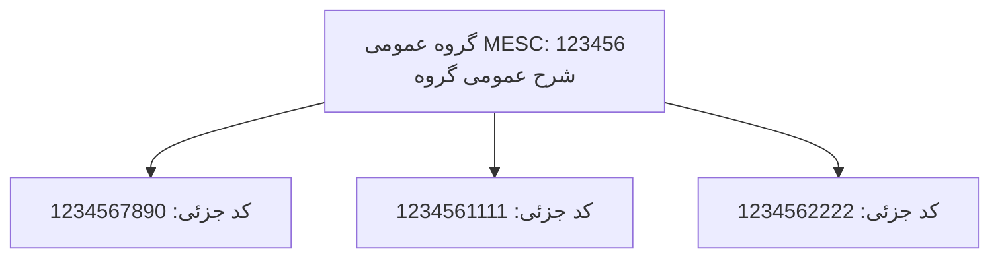

# قواعد کدگذاری اقلام MESC

## تعریف MESC

کد MESC شناسه اصلی اقلام در سامانه است. این کد برای تشخیص، گروه‌بندی، گزارش‌گیری و کنترل اقلام خرید استفاده می‌شود.

## قانون شش رقم اول

شش رقم اول کد MESC نشان‌دهنده گروه عمومی کالا و شرح عمومی آن است. هر کد جزئی‌تر که با این شش رقم شروع شود، فرزند همان گروه عمومی محسوب می‌شود.

مثال مفهومی:

| کد MESC | گروه عمومی شش‌رقمی | شرح عمومی گروه |
| --- | --- | --- |
| 1234567890 | 123456 | شرح عمومی مربوط به گروه 123456 |
| 1234561111 | 123456 | شرح عمومی مربوط به گروه 123456 |
| 6543210001 | 654321 | شرح عمومی مربوط به گروه 654321 |

## قواعد نمایش

- هرجا کد قلم کالا نمایش داده می‌شود، شرح عمومی گروه MESC نیز باید نمایش داده شود.
- در فرم‌ها، جدول‌ها و گزارش‌ها نباید فقط کد جزئی نمایش داده شود.
- اگر شرح اختصاصی قلم وجود داشته باشد، باید در کنار شرح عمومی و با تفکیک روشن نمایش داده شود.

نمایش پیشنهادی در جدول:

| کد MESC | شرح عمومی MESC | شرح قلم | مقدار |
| --- | --- | --- | --- |
| 1234567890 | شرح عمومی گروه 123456 | شرح اختصاصی قلم | 10 |

## قواعد گروه‌بندی

اگر چند قلم دارای شش رقم اول یکسان باشند، در گزارش‌ها و فرم‌های رسمی باید زیر یک شرح عمومی گروه‌بندی شوند.

## رفتار مورد انتظار سیستم

### هنگام ثبت قلم

- سیستم باید حداقل شش رقم اول کد MESC را استخراج کند.
- سیستم باید شرح عمومی متناظر با شش رقم اول را پیدا کند.
- اگر شرح عمومی پیدا نشود، ثبت قلم باید بر اساس سیاست اعتبارسنجی فاز پیاده‌سازی متوقف یا نیازمند تایید شود.

### هنگام نمایش قلم

- کد کامل MESC نمایش داده شود.
- گروه عمومی شش‌رقمی نمایش داده شود یا حداقل در داده قابل مشاهده باشد.
- شرح عمومی گروه نمایش داده شود.

### هنگام گزارش‌گیری

- اقلام ابتدا بر اساس گروه عمومی شش‌رقمی مرتب شوند.
- برای هر گروه، شرح عمومی یک بار به عنوان عنوان بخش نمایش داده شود.
- اقلام جزئی زیر همان بخش فهرست شوند.

## ساختار داده پیشنهادی برای آینده

در فاز پیاده‌سازی، بهتر است موجودیت‌های جداگانه برای گروه عمومی MESC و قلم خرید در نظر گرفته شود.

مفاهیم پیشنهادی:

- MescGroup: کد شش‌رقمی، شرح عمومی، وضعیت فعال بودن
- PurchaseItem: کد کامل MESC، شرح قلم، مقدار، واحد، ارتباط با پرونده خرید
- ارتباط PurchaseItem با MescGroup از طریق شش رقم اول کد

## نکات اعتبارسنجی

- کد MESC باید فقط شامل ارقام مجاز باشد، مگر اینکه در قواعد رسمی سازمان خلاف آن تعیین شود.
- کد نباید کمتر از شش رقم باشد.
- شش رقم اول نباید خالی یا نامعتبر باشد.
- تغییر کد MESC پس از ورود پرونده به مراحل رسمی باید ثبت تاریخچه داشته باشد.

