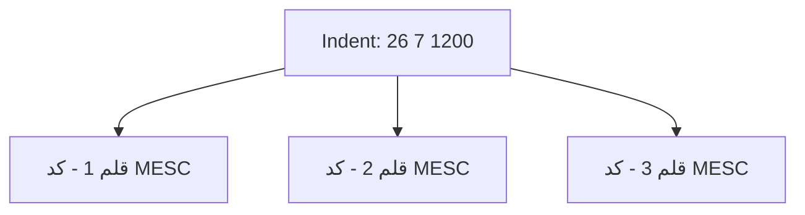

# قواعد شماره‌گذاری Indent

## تعریف Indent

Indent یا درخواست خرید سندی است که شامل چند قلم کالا زیر یک شماره واحد است. این سند می‌تواند مبنای تشکیل پرونده خرید باشد و باید در سامانه به صورت ساخت‌یافته ثبت شود.

## قالب شماره Indent

قالب شماره Indent به صورت زیر است:

```text
XX X XXXX
```

معنی بخش‌ها:

| بخش | طول | معنی |
| --- | --- | --- |
| XX | 2 رقم | سال سند |
| X | 1 رقم | نوع درخواست |
| XXXX | 4 رقم | شماره ترتیبی |

## نوع درخواست

رقم نوع درخواست قواعد زیر را دارد:

| رقم | نوع درخواست |
| --- | --- |
| 0 | خرید مستقیم |
| 1 | خرید مستقیم |
| 2 | خرید مستقیم |
| 3 | Indent دستی |
| 4 | Indent دستی |
| 5 | Indent سیستمی |
| 6 | Indent سیستمی |
| 7 | Indent سیستمی |
| 8 | Indent سیستمی |
| 9 | Indent سیستمی |

## نمونه‌ها

| شماره Indent | سال | نوع | ترتیب |
| --- | --- | --- | --- |
| 26 1 0001 | 26 | خرید مستقیم | 0001 |
| 26 3 0145 | 26 | Indent دستی | 0145 |
| 26 7 1200 | 26 | Indent سیستمی | 1200 |

## قواعد اعتبارسنجی

- شماره باید دقیقاً از سه بخش تشکیل شود.
- بخش اول باید دو رقم باشد.
- بخش دوم باید یک رقم باشد.
- بخش سوم باید چهار رقم باشد.
- نوع درخواست فقط می‌تواند یکی از ارقام 0 تا 9 باشد.
- شماره ترتیبی باید چهار رقم باشد و صفرهای ابتدای آن حفظ شوند.
- یک شماره Indent نباید به صورت تکراری برای چند سند مستقل ثبت شود.

## رابطه Indent با اقلام

هر Indent شامل چند قلم کالا است. همه اقلام زیر یک شماره Indent قرار می‌گیرند و می‌توانند دارای گروه‌های مختلف MESC باشند.



## رابطه Indent با پرونده خرید

یک پرونده خرید می‌تواند به یک Indent مرجع متصل شود. در فازهای بعدی باید روشن شود که آیا یک پرونده می‌تواند چند Indent داشته باشد یا خیر. برای شروع، طراحی عملی‌تر این است که هر پرونده خرید یک Indent اصلی داشته باشد و اقلام پرونده از همان Indent مشتق شوند.

## قواعد نمایشی

- شماره Indent باید با حفظ فاصله یا قالب خوانا نمایش داده شود.
- در جستجو بهتر است امکان جستجو با فاصله و بدون فاصله وجود داشته باشد.
- نوع درخواست باید به صورت متن قابل فهم کنار شماره نمایش داده شود.

نمونه نمایش:

| شماره Indent | نوع درخواست | تعداد اقلام |
| --- | --- | --- |
| 26 7 1200 | Indent سیستمی | 8 |

