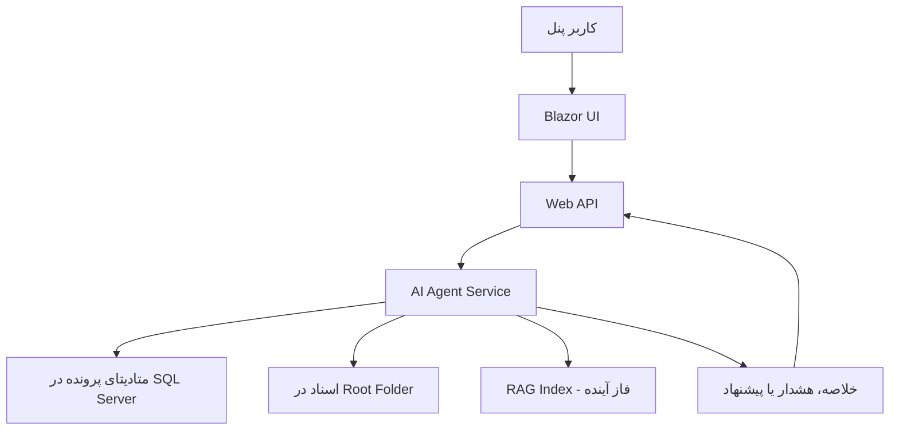

# راهبرد AI Agent

## هدف

AI Agent در PetroProcure یک قابلیت کمکی برای افزایش دقت، سرعت و شفافیت فرآیند خرید است. این ماژول نباید جایگزین تصمیم انسانی یا قوانین رسمی شود، بلکه باید در بررسی، خلاصه‌سازی، کنترل اولیه و جستجوی هوشمند به کاربران کمک کند.

## قابلیت‌های آینده

### 1. بررسی اسناد پرونده

AI Agent می‌تواند اسناد بارگذاری‌شده در پرونده خرید را بررسی کند و موارد احتمالی مانند نقص مدارک، مغایرت اطلاعات یا نبود سند مهم را گزارش دهد.

نمونه کاربرد:

- بررسی وجود درخواست خرید
- بررسی وجود صورتجلسه کمیسیون در پرونده‌های مناقصه
- تشخیص نبود فایل مشخصات فنی

### 2. کنترل قواعد خرید

Agent می‌تواند قواعد تعریف‌شده خرید را با اطلاعات پرونده مقایسه کند و هشدارهای اولیه بدهد.

نمونه کاربرد:

- آیا پرونده با نوع خرید مستقیم مدارک لازم را دارد؟
- آیا اقلام دارای کد MESC معتبر هستند؟
- آیا Indent معتبر و قابل تشخیص است؟

### 3. خلاصه‌سازی پرونده خرید

Agent می‌تواند یک خلاصه مدیریتی از پرونده تولید کند.

خلاصه می‌تواند شامل موارد زیر باشد:

- وضعیت فعلی پرونده
- اقلام اصلی و گروه‌های MESC
- مدارک موجود و مدارک ناقص
- آخرین اقدام‌ها
- تصمیم‌های ثبت‌شده

### 4. آماده‌سازی برای RAG

در فازهای بعدی، اسناد پرونده‌ها می‌توانند برای بازیابی هوشمند استفاده شوند. RAG باید روی اسناد کنترل‌شده، متادیتای معتبر و سطح دسترسی مناسب بنا شود.

## معماری مفهومی AI

## اصول طراحی

- Agent فقط از طریق API یا سرویس‌های مجاز به داده‌ها دسترسی داشته باشد.
- خروجی Agent باید به عنوان پیشنهاد یا تحلیل کمکی نمایش داده شود.
- تصمیم نهایی باید توسط کاربر مجاز ثبت شود.
- دسترسی Agent به اسناد باید تابع سطح دسترسی پرونده باشد.
- همه تحلیل‌های مهم Agent باید قابل ثبت و بازبینی باشند.

## داده‌های لازم برای آماده‌سازی AI

برای اینکه در آینده AI Agent قابل استفاده باشد، از فازهای اولیه باید داده‌ها تمیز و قابل اتکا ثبت شوند:

- وضعیت دقیق پرونده
- نوع سندها
- تاریخچه اقدامات
- کد و شرح MESC
- شماره Indent و نوع درخواست
- متادیتای فایل‌ها
- ارتباط هر سند با پرونده و مرحله کاری

## ریسک‌ها و کنترل‌ها

| ریسک | کنترل پیشنهادی |
| --- | --- |
| برداشت اشتباه از اسناد | نمایش خروجی به عنوان پیشنهاد و الزام تایید انسانی |
| دسترسی غیرمجاز به اطلاعات | اعمال کنترل دسترسی قبل از پردازش |
| پاسخ بدون منبع | در RAG آینده، نمایش ارجاع به سند و صفحه |
| وابستگی بیش از حد کاربران | ثبت تصمیم رسمی فقط توسط کاربر مجاز |
| کیفیت پایین اسناد اسکن‌شده | استفاده از OCR و ثبت وضعیت کیفیت استخراج متن |

## مسیر پیاده‌سازی پیشنهادی

1. آماده‌سازی متادیتای اسناد و پرونده‌ها
2. استخراج متن از فایل‌های قابل پردازش
3. ایجاد خلاصه ساده پرونده بر اساس داده‌های ساخت‌یافته
4. افزودن بررسی‌های قانون‌محور
5. افزودن تحلیل اسناد
6. ایجاد ایندکس RAG با کنترل دسترسی

