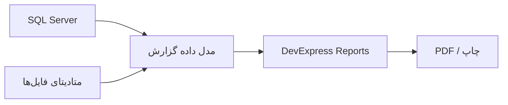

# راهبرد گزارش‌گیری

## هدف

گزارش‌گیری در PetroProcure باید بتواند خروجی‌های رسمی، قابل چاپ و قابل اتکا برای پرونده‌های خرید تولید کند. در فازهای بعدی DevExpress Reports ابزار اصلی تولید گزارش‌ها و اسناد چاپی خواهد بود.

## اصل طراحی

حتی اگر گزارش‌گیری رسمی در فاز اول پیاده‌سازی نشود، ساختار داده‌ها باید از ابتدا برای گزارش آماده باشد. اطلاعات نباید فقط در متن‌های آزاد یا فایل‌های غیرساخت‌یافته ذخیره شود.

## ابزار گزارش‌گیری

DevExpress Reports در فازهای بعدی برای موارد زیر استفاده خواهد شد:

- فرم‌های رسمی پرونده خرید
- گزارش اقلام خرید
- گزارش Indent
- گزارش اسناد و پیوست‌ها
- گزارش گردش کار پرونده
- خروجی‌های چاپی یا PDF

## قواعد مهم گزارش‌ها

### نمایش MESC

در هر گزارشی که اقلام را نمایش می‌دهد:

- کد کامل MESC باید نمایش داده شود.
- شرح عمومی گروه MESC باید نمایش داده شود.
- اگر چند قلم در یک گروه شش‌رقمی قرار دارند، زیر همان شرح عمومی گروه‌بندی شوند.

نمونه ساختار گزارش:

```text
شرح عمومی MESC: گروه 123456
  - کد 1234567890 | شرح قلم | مقدار
  - کد 1234561111 | شرح قلم | مقدار

شرح عمومی MESC: گروه 654321
  - کد 6543210001 | شرح قلم | مقدار
```

### نمایش Indent

گزارش Indent باید شماره را با قالب خوانا نمایش دهد و نوع درخواست را نیز نشان دهد.

نمونه:

```text
شماره Indent: 26 7 1200
نوع درخواست: Indent سیستمی
```

### نمایش پرونده خرید

گزارش پرونده خرید باید حداقل شامل این بخش‌ها باشد:

- اطلاعات پایه پرونده
- اطلاعات Indent
- اقلام گروه‌بندی‌شده بر اساس MESC
- اسناد و پیوست‌های ثبت‌شده
- تاریخچه اقدامات
- وضعیت نهایی یا جاری پرونده

## منابع داده گزارش‌ها

گزارش‌ها باید از داده‌های ساخت‌یافته API یا پایگاه داده تغذیه شوند. وابستگی مستقیم گزارش به فایل‌های پراکنده یا داده‌های واردشده فقط در UI باید پرهیز شود.



## طراحی مدل داده گزارش

برای جلوگیری از پیچیدگی گزارش‌ها، بهتر است در فاز پیاده‌سازی مدل‌های داده مخصوص گزارش ایجاد شود. این مدل‌ها می‌توانند داده‌های دامنه را در قالب مناسب چاپ آماده کنند.

نمونه مدل‌های آینده:

- PurchaseFileReportModel
- IndentReportModel
- MescGroupedItemsReportModel
- AttachmentListReportModel
- WorkflowHistoryReportModel

## خروجی‌های پیشنهادی فازهای بعدی

| گزارش | هدف |
| --- | --- |
| خلاصه پرونده خرید | نمایش وضعیت و اطلاعات اصلی پرونده |
| لیست اقلام پرونده | نمایش اقلام با گروه‌بندی MESC |
| فرم Indent | نمایش درخواست خرید و اقلام زیر آن |
| لیست اسناد پرونده | کنترل مدارک و پیوست‌ها |
| تاریخچه گردش کار | ردیابی اقدامات واحدها |
| صورتجلسه کمیسیون | خروجی رسمی مربوط به مناقصه |

## نکات اجرایی برای آینده

- گزارش‌ها باید از همان قواعد اعتبارسنجی دامنه استفاده کنند.
- قالب‌های رسمی باید نسخه‌بندی شوند.
- خروجی PDF باید قابل آرشیو در Root Folder باشد.
- گزارش تولیدشده باید به پرونده خرید متصل شود.
- تولید گزارش رسمی باید در تاریخچه پرونده ثبت شود.

