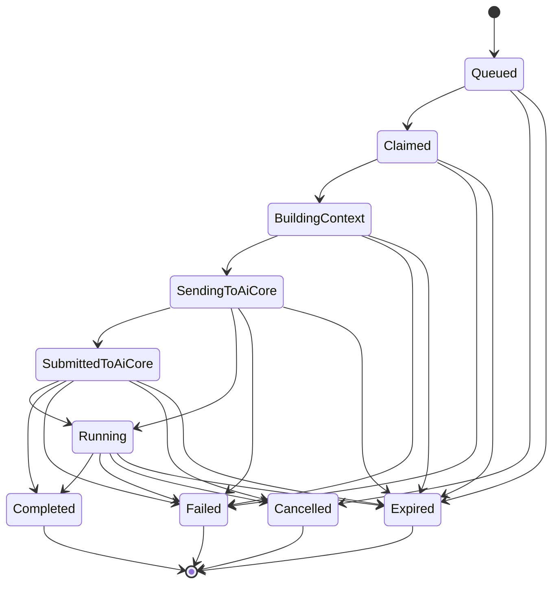

# AI Job Lifecycle

Date: 2026-06-26

## Purpose

This document defines the lifecycle for PetroProcure asynchronous AI analysis jobs.

The lifecycle supports this target flow:

`PetroProcure.Web -> PetroProcure.Api -> AiEvaluationJob -> PetroProcure.Worker -> AiCore -> PetroProcure.Api Callback -> Database -> Web polling/SignalR`

## Required Lifecycle

1. User requests AI analysis from Web.
2. API creates `AiEvaluationJob` with status `Queued`.
3. API returns `202 Accepted` and `jobId`.
4. Worker claims queued jobs.
5. Worker sends job to AiCore.
6. Job status becomes `SubmittedToAiCore` or `Running`.
7. AiCore processes the request.
8. AiCore calls PetroProcure.Api callback endpoint.
9. API validates callback signature/token.
10. API saves `AiEvaluationResult` and updates job status to `Completed` or `Failed`.
11. Web gets status/result using polling first.

## Job Statuses

### Queued

The job has been created by `PetroProcure.Api` and is waiting for `PetroProcure.Worker`.

Allowed transitions:

- `Claimed`
- `Cancelled`
- `Expired`

### Claimed

A worker has claimed the job for processing. The claim should include worker id, claim timestamp, and claim expiration.

Allowed transitions:

- `BuildingContext`
- `Failed`
- `Expired`

### BuildingContext

The worker is collecting PetroProcure data needed for the AI prompt, including entity metadata, workflow history, documents metadata, legal rule context, and user question.

Allowed transitions:

- `SendingToAiCore`
- `Failed`
- `Expired`

### SendingToAiCore

The worker is submitting the job to AiCore.

Allowed transitions:

- `SubmittedToAiCore`
- `Running`
- `Failed`
- `Expired`

### SubmittedToAiCore

AiCore accepted the job and returned a provider-side job id. PetroProcure is waiting for AiCore processing or callback.

Allowed transitions:

- `Running`
- `Completed`
- `Failed`
- `Cancelled`
- `Expired`

### Running

AiCore has accepted and is actively processing the job, or PetroProcure has received progress information.

Allowed transitions:

- `Completed`
- `Failed`
- `Cancelled`
- `Expired`

### Completed

A valid callback was received and an `AiEvaluationResult` was saved.

Allowed transitions:

- None.

Completed is terminal.

### Failed

The job failed before submission, during submission, during AiCore processing, or during callback result handling.

Allowed transitions:

- Retry should create a new attempt or move the existing job back to `Queued` only through an explicit retry operation.

Failed is terminal unless a retry policy or user action requeues it.

### Cancelled

The job was cancelled before completion.

Allowed transitions:

- None, unless an explicit retry operation creates a new job or requeues the current job.

Cancelled is terminal.

### Expired

The job exceeded its configured lifetime, callback deadline, or claim timeout policy.

Allowed transitions:

- None, unless an explicit retry operation creates a new job or requeues the current job.

Expired is terminal.

## State Machine

## Job Data

An `AiEvaluationJob` should track:

- `Id`
- `EntityType`
- `EntityId`
- `AnalysisType`
- `Status`
- `RequestedByUserId`
- `RequestedAtUtc`
- `ClaimedBy`
- `ClaimedAtUtc`
- `ClaimExpiresAtUtc`
- `AttemptCount`
- `MaxAttempts`
- `LastErrorCode`
- `LastErrorMessage`
- `AiCoreJobId`
- `CorrelationId`
- `ExternalJobId`
- `CallbackDeliveryId`
- `SubmittedAtUtc`
- `CompletedAtUtc`
- `ExpiresAtUtc`
- `MetadataJson`

`ExternalJobId` should be the PetroProcure job id sent to AiCore. `AiCoreJobId` should store AiCore's returned job id.

## Result Data

An `AiEvaluationResult` should track:

- `Id`
- `JobId`
- `EntityType`
- `EntityId`
- `AnalysisType`
- `Provider`
- `Model`
- `Summary`
- `RiskLevel`
- `Status`
- `CreatedAtUtc`
- `CompletedAtUtc`
- `Usage`
- `AdvisoryDisclaimer`
- Findings
- Recommendations

The result should be written only after callback validation succeeds.

## Idempotency

Callbacks must be idempotent.

Rules:

- A duplicate callback with the same `externalJobId` and `X-AiCore-Delivery-Id` must not create duplicate results.
- A duplicate successful callback for an already completed job should return success without rewriting the result unless the payload hash matches.
- A conflicting callback for a terminal job must be recorded as an audit event and rejected or ignored according to policy.
- Result save and job status update must happen in one transaction.

## Retry and Expiration

Worker retry policy should distinguish:

- Context-building failures
- AiCore submission failures
- AiCore accepted-but-no-callback failures
- Callback validation failures
- Callback payload validation failures

Recommended behavior:

- Retry transient submission failures with backoff.
- Do not retry invalid request payloads automatically.
- Expire jobs if AiCore does not callback within configured tolerance.
- Keep a full audit trail for failed and expired jobs.

## Web Polling

Polling is the first delivery mechanism.

Recommended endpoints:

- `GET /api/ai/jobs/{jobId}`
- `GET /api/ai/jobs/{jobId}/result`

Polling response should include:

- `jobId`
- `status`
- `entityType`
- `entityId`
- `analysisType`
- `createdAtUtc`
- `updatedAtUtc`
- `completedAtUtc`
- `errorMessage`
- `result`, when available

SignalR can later publish the same status transitions after polling behavior is stable.

