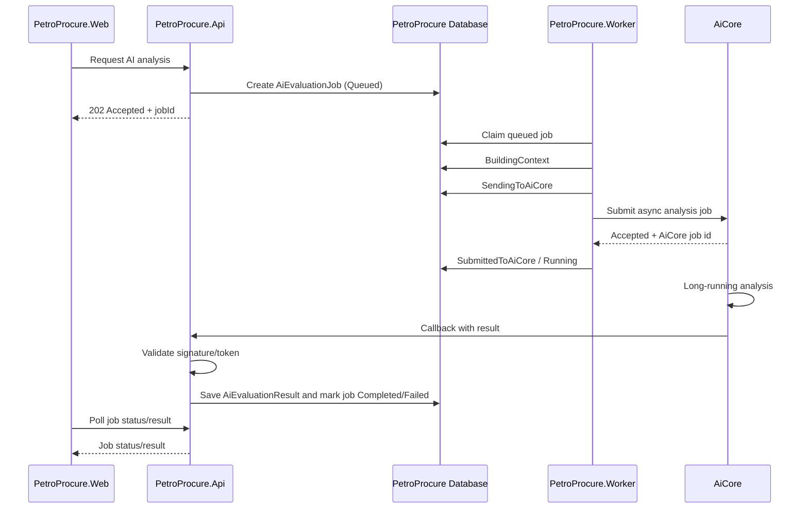

# Async AI Agent Architecture

Date: 2026-06-26

## Purpose

PetroProcure AI analysis must run as an asynchronous advisory workflow. Long-running AI work must not be executed as a synchronous request from `PetroProcure.Web` to `PetroProcure.Api`, or from `PetroProcure.Api` to AiCore.

AiCore is a separate production AI platform. Local development may run both systems on one machine, but the architecture must assume AiCore is deployed on a separate server.

## Target Flow

## Components

### PetroProcure.Web

Responsibilities:

- Send short analysis request to `PetroProcure.Api`.
- Receive `202 Accepted` with `jobId`.
- Poll job status/result first.
- Use SignalR later for push updates.
- Display AI output as advisory only.
- Use Persian labels in UI.

Web must not call AiCore directly.

### PetroProcure.Api

Responsibilities:

- Authorize the user request.
- Create the internal `AiEvaluationJob`.
- Return `202 Accepted` immediately.
- Expose job status/result endpoints for polling.
- Expose the AiCore callback endpoint.
- Validate callback authentication and signature.
- Persist callback result idempotently.
- Keep AI output advisory and never convert it into final approval.

Callback endpoints must live in `PetroProcure.Api`, never in `PetroProcure.Web`.

### PetroProcure.Worker

Responsibilities:

- Claim queued AI jobs from the database.
- Build the analysis context using PetroProcure application/infrastructure services.
- Submit jobs to AiCore through an adapter interface.
- Update job status and provider correlation fields.
- Retry transient failures according to policy.
- Expire jobs that exceed configured lifetime.

Worker must treat AiCore as a remote service.

### AiCore

Responsibilities:

- Accept async analysis jobs from PetroProcure.
- Perform long-running AI analysis.
- Return result through PetroProcure API callback.
- Include correlation fields and callback authentication material.

AiCore must not make final business decisions. It may return summaries, findings, warnings, recommendations, and advisory analysis only.

## Integration Modes

### LocalOllamaDirect

Purpose:

- Development fallback only.
- Useful when AiCore is unavailable and the developer needs local prompt iteration.

Rules:

- Not allowed in production.
- Must be explicitly configured.
- Must still mark results as advisory.
- Should not bypass authorization or persistence boundaries.

### SyncAiCoreDirect

Purpose:

- Debug-only diagnostic mode.
- Useful to validate AiCore connectivity and prompt/response shape.

Rules:

- Not allowed for production long-running analysis.
- Must not be the default path.
- Must not be called from normal Web user workflows.
- Should be limited to health checks, admin test connection, or controlled diagnostics.

### AsyncAiCoreJob

Purpose:

- Production default.

Rules:

- Web calls API.
- API creates an internal job and returns `202 Accepted`.
- Worker submits to AiCore.
- AiCore returns callback to API.
- Web reads status/result through polling first and SignalR later.

## Data Boundaries

Domain objects must remain independent from:

- EF Core
- ASP.NET Core
- Web UI
- Infrastructure implementation details
- AiCore transport details

The domain may contain job concepts and status values, but HTTP headers, database mappings, callback signatures, and AiCore DTO details belong outside the domain.

## Advisory-Only Rule

Every AI result must be treated as advisory. AI can provide:

- Summaries
- Findings
- Warnings
- Recommendations
- Risk indicators
- Legal/procurement compliance observations

AI must not:

- Approve a purchase file
- Reject a supplier
- Select a winner
- Override a commission
- Create a final legal decision
- Change official workflow status without a human action

## Recommended API Surface

Initial Web-to-API flow:

- `POST /api/ai/jobs`
- `GET /api/ai/jobs/{jobId}`
- `GET /api/ai/jobs/{jobId}/result`

Entity-specific convenience endpoints may wrap the generic job endpoint:

- `POST /api/ai/purchase-files/{purchaseFileId}/analysis-jobs`
- `POST /api/ai/tenders/{tenderId}/analysis-jobs`
- `POST /api/ai/contracts/{contractId}/analysis-jobs`
- `POST /api/ai/purchase-orders/{purchaseOrderId}/analysis-jobs`
- `POST /api/ai/warehouse-receipts/{receiptId}/analysis-jobs`
- `POST /api/ai/legal-compliance/analysis-jobs`

AiCore callback endpoint:

- `POST /api/ai/aicore/callbacks`

## Implementation Phasing

1. Add internal job model and status values.
2. Add API endpoints that create jobs and return `202 Accepted`.
3. Add polling endpoints.
4. Add worker claiming and context-building.
5. Add AiCore async adapter interface.
6. Add callback endpoint and signature validation.
7. Update Web components to use polling.
8. Add SignalR notifications after polling is stable.

