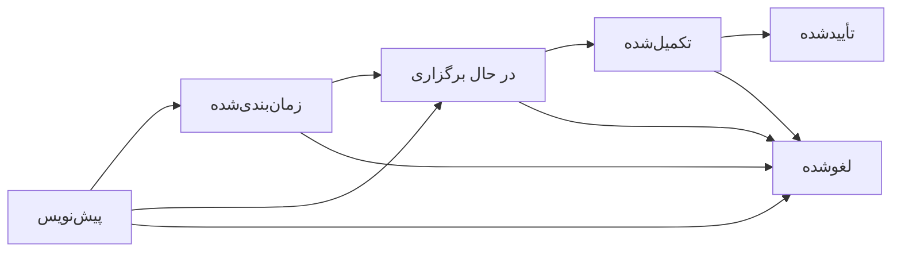

# جلسات کمیسیون مناقصه

ماژول جلسات کمیسیون مناقصه برای ثبت رسمی جلسه‌های انسانی کمیسیون، اعضا، دستور جلسه، صورتجلسه، تصمیمات و پیوست‌های مرتبط با یک مناقصه طراحی شده است. هر جلسه الزاماً به یک مناقصه و از طریق آن به یک پرونده خرید متصل است.

## هدف کسب‌وکاری

- ثبت جلسه رسمی کمیسیون برای بررسی مناقصه‌ها
- نگهداری اعضا و نقش‌ها مانند رئیس کمیسیون، دبیر، عضو، ناظر و کارشناسان
- ثبت دستور جلسه، صورتجلسه و تصمیم‌ها
- آماده‌سازی مسیر آینده برای گزارش رسمی صورتجلسه، قرارداد و سفارش خرید
- حفظ اصل تصمیم انسانی؛ سیستم و AI تصمیم نهایی نمی‌گیرند

## ارتباط با Tender و PurchaseFile

- `TenderCommissionSession.TenderId` جلسه را به مناقصه وصل می‌کند.
- `TenderCommissionSession.PurchaseFileId` از مناقصه استخراج و در جلسه ذخیره می‌شود.
- از صفحه جزئیات مناقصه می‌توان جلسات کمیسیون مرتبط را مشاهده یا جلسه جدید ایجاد کرد.
- تصمیم برنده، در صورت داشتن پیشنهاد منتخب معتبر، می‌تواند وضعیت مناقصه را با انتخاب برنده به‌روزرسانی کند.

## چرخه وضعیت جلسه

قواعد مهم:

- جلسه بدون حداقل یک عضو قابل تأیید نیست.
- جلسه بدون حداقل یک صورتجلسه یا تصمیم قابل تأیید نیست.
- هر جلسه فقط یک رئیس کمیسیون و یک دبیر دارد.
- جلسه تأییدشده یا لغوشده read-only است.
- تصمیم برنده باید پیشنهاد و تأمین‌کننده منتخب داشته باشد.

## نقش اعضا

- رئیس کمیسیون
- دبیر
- عضو
- ناظر
- کارشناس فنی
- کارشناس مالی

## تصمیمات

انواع تصمیمات اولیه:

- پیشنهاد برنده
- تأیید برنده
- رد همه پیشنهادها
- تجدید مناقصه
- درخواست بررسی فنی
- درخواست بررسی مالی
- لغو مناقصه
- سایر

تأیید تصمیم برنده فقط ثبت سیستمی تصمیم انسانی است و جایگزین رأی یا تصویب انسانی نمی‌شود.

## مجوزها

- `Commission.View`
- `Commission.Create`
- `Commission.Edit`
- `Commission.Schedule`
- `Commission.Start`
- `Commission.Complete`
- `Commission.Approve`
- `Commission.Cancel`
- `Commission.ManageMembers`
- `Commission.ManageAgenda`
- `Commission.ManageMinutes`
- `Commission.ManageDecisions`
- `Commission.ManageDocuments`

همه endpointها با مجوزهای بالا محافظت می‌شوند و شناسه کاربر همیشه از Claims خوانده می‌شود.

## API

مسیرهای اصلی:

- `GET /api/commission/sessions`
- `GET /api/commission/sessions/{id}`
- `GET /api/commission/sessions/by-number/{sessionNumber}`
- `GET /api/tenders/{tenderId}/commission-sessions`
- `GET /api/purchase-files/{purchaseFileId}/commission-sessions`
- `POST /api/commission/sessions`
- `POST /api/commission/sessions/from-tender/{tenderId}`
- `PUT /api/commission/sessions/{id}`
- `POST /api/commission/sessions/{id}/schedule`
- `POST /api/commission/sessions/{id}/start`
- `POST /api/commission/sessions/{id}/complete`
- `POST /api/commission/sessions/{id}/approve`
- `POST /api/commission/sessions/{id}/cancel`

زیرمنابع:

- اعضا: `/members`
- دستور جلسه: `/agenda`
- صورتجلسه: `/minutes`
- تصمیمات: `/decisions`

## Web

صفحات اضافه‌شده:

- `/tender-commission/sessions`
- `/tender-commission/sessions/create`
- `/tender-commission/sessions/from-tender/{tenderId}`
- `/tender-commission/sessions/{id}`

در صفحه جزئیات مناقصه نیز تب «جلسات کمیسیون» اضافه شده است.

## گزارش و AI آینده

در این فاز گزارش رسمی کمیسیون پیاده‌سازی نشده است، اما داده‌ها برای گزارش‌های آینده آماده شده‌اند:

- گزارش صورتجلسه کمیسیون
- گزارش تصمیم کمیسیون
- گزارش تأیید برنده

AI در آینده فقط می‌تواند خلاصه، هشدار نقص مدارک یا کنترل قواعد انجام دهد. تصمیم نهایی همچنان با کاربران انسانی و کمیسیون مجاز است.
